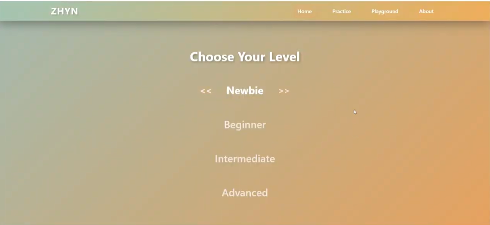
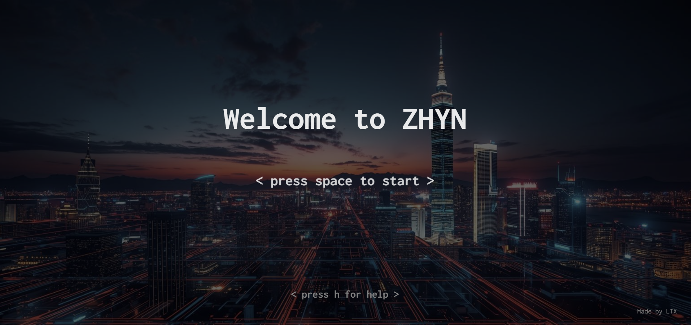
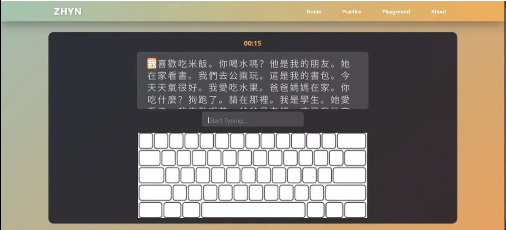
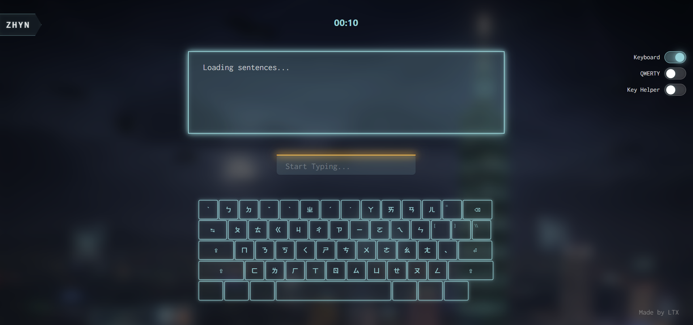

# Design Document

1. **Database Population**

I originally planned to have the user input the set of characters that they have learned, and the LLM would generate sentences using words that the user has inputted. This idea is kind of like a flashcard system where the user can track vocabulary specific to their learning and get typing practice with it. However, I pivoted to having a premade database of vocabs split into 4 categories (newbie, beginner, intermediate, advanced), as this would reduce user friction. Once the user lands on the site, they can start typing immediately instead of having to input hundreds of words before they can start. This change also meant that I had to manually build the database of vocabularies and pre-populate in MongoDB.

2. **Key Highlighting**

I thought about how the course staff might be testing my website and I figured since most people don't know the Zhuyin keyboard, I would need to add a way for someone who doesn't know Zhuyin to be able to use/test the typing game. As a result, I decided to add a key highlighting feature which highlights the next key that user needs to press. This also conveniently expands my stakeholders as well, since people with no Zhuyin experience can also use it, not just people who have some experience and just needs more practice. It ended up being one of the coolest UI of my project.

3. **UI Design**

My UI went through a very big change between 4b checkin and 4b final. Orignally, I wanted to mirror the simple and clean designs of other typing websites that I have used such as TypingClub.com. However, through the Visual Design Study, I looked around for inspiration and decided it would be much more fun to do a video game-inspired UI. A lot of my UI elements were inspired by a past WebLab project (Fortuna by Kenneth Choi).

However, despite the visual changes, the layout mostly stayed true to the original wireframe that I drew.

| Old design | New design |
|:----------:|:----------:|
|  |  |
|  |  |

4. **Concept Changes**

My concept definitely underwent some evolution along the way. My original concept spec in Assignment 2 had a Database concept, a Quiz concept, and a DisplayLanguage concept. However, when I implemented it, I decided to remove the DisplayLanguage concept as it was a bit extraneous for the scope of this project, and  also split the Database into two concepts - LevelMap and ZhuyinDictionary. As I work more with these concepts in my app, I realized how useful their modularity and simplicity were, and how things just clicked into place when the concepts are formed correctly.

